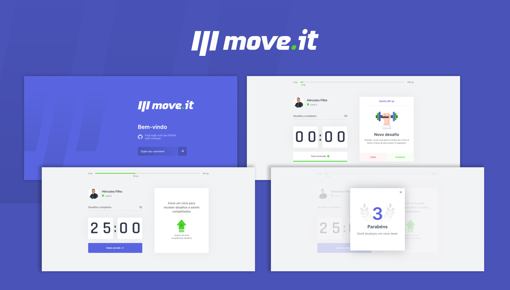

<p align="center">
  

  
</p>

## 💻 Sobre o projeto

> <b>MoveIt</b> é um projeto Front-End criado utilizando ReactJS, NextJS e TypeScript durante a NLW#4 da [Rocketseat](https://github.com/Rocketseat) com a adição da tela de login e outras funcionalidades novas.

<div align="center">
  <sub>O <strong>MoveIt</strong> foi desenvolvido com ❤︎ pelo
    <a href="https://github.com/hrcules">Hércules Filho</a>
  </sub>
</div>

## 🛠 Tecnologias

As seguintes ferramentas foram usadas na construção do projeto:

- [ReactJS](https://reactjs.org/)
- [NextJS](https://nextjs.org/)
- [TypeScript](https://www.typescriptlang.org/)
- [Axios](https://github.com/axios/axios)
- [MongoDB](https://www.mongodb.com/)

## 🚀 Como executar o projeto

💡 Antes de começar, você vai precisar ter instalado em sua máquina as seguintes ferramentas: [GIT](https://git-scm.com), [Yarn](https://yarnpkg.com/). Além disso é bom ter um editor para trabalhar com o código como [VSCode](https://code.visualstudio.com/)

### 🎲 Rodando a aplicação

### Pré-requisitos

⚠️ Necessário criar um arquivo .env com a seguinte informação:

- MONGODB_URI - uri do banco mongodb

```bash
# Clone este repositório
$ git clone https://github.com/hrcules/moveit

# Acesse a pasta do projeto no terminal/cmd
$ cd moveit

# Instale as dependências
$ yarn

# Execute a aplicação em modo de desenvolvimento
$ yarn dev

# O servidor inciará na porta:3000 - acesse http://localhost:3000
```

## 📝 Licença

Este projeto esta sobe a licença MIT.


